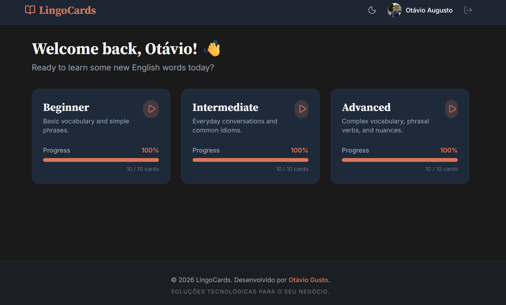

<div align="center">
  <h1>🃏 LingoCards</h1>
  <p><strong>Aprenda inglês com flashcards interativos e acompanhe seu progresso</strong></p>

  <a href="https://lingocard.netlify.app/login">
    
  </a>
  &nbsp;
  
  &nbsp;
  
</div>

---

## 📸 Preview

<div align="center">
  
</div>

---

## 📖 O que é o LingoCards?

**LingoCards** é uma aplicação web de flashcards para aprendizado de vocabulário em inglês. O sistema é dividido em **níveis** (Básico, Intermediário e Avançado), e cada nível contém um conjunto de cartões com palavras em inglês no verso e a tradução com informações extras na frente.

O usuário pode navegar pelos cartões, virar cada um para ver a tradução, e o progresso é **salvo automaticamente** no banco de dados em tempo real. Tudo com autenticação segura e suporte a tema claro/escuro.

### ✨ Funcionalidades

- 🔐 **Autenticação** — Login com Google via Firebase Auth
- 📊 **Dashboard** — Visualize todos os níveis e o percentual de progresso de cada um
- 🃏 **Flashcards interativos** — Animação 3D de virar o cartão ao clicar
- 💾 **Progresso persistente** — Cada cartão visto é salvo no Firestore em tempo real
- 🌙 **Tema escuro/claro** — Toggle de dark mode disponível no perfil
- 👤 **Perfil do usuário** — Visualize suas estatísticas gerais de aprendizado
- 📱 **Responsivo** — Funciona bem em mobile e desktop

---

## 🛠️ Tech Stack

| Tecnologia | Descrição |
|---|---|
| ⚛️ **React 19** | Biblioteca principal de UI |
| ⚡ **Vite 6** | Build tool e dev server ultrarrápido |
| 🟦 **TypeScript** | Tipagem estática para maior robustez |
| 🎨 **Tailwind CSS v4** | Estilização com utility classes |
| 🔥 **Firebase** | Auth (Google Login) + Firestore (banco de dados em tempo real) |
| 🎞️ **Motion (Framer Motion)** | Animações fluidas dos flashcards |
| 🔗 **React Router DOM v7** | Roteamento client-side com rotas protegidas |
| 🎯 **Lucide React** | Ícones modernos e consistentes |
| 🌐 **Netlify** | Deploy e hospedagem |

---

## 🚀 Como rodar localmente

### Pré-requisitos

- Node.js 18+
- npm ou yarn
- Projeto configurado no Firebase (Auth + Firestore)

### Instalação

```bash
# Clone o repositório
git clone https://github.com/otaviogusto/LingoCards.git

# Acesse a pasta
cd LingoCards

# Instale as dependências
npm install
```

### Configuração do ambiente

Crie um arquivo `.env` na raiz do projeto com base no `.env.example`:

```env
VITE_FIREBASE_API_KEY=sua_api_key
VITE_FIREBASE_AUTH_DOMAIN=seu_auth_domain
VITE_FIREBASE_PROJECT_ID=seu_project_id
VITE_FIREBASE_STORAGE_BUCKET=seu_storage_bucket
VITE_FIREBASE_MESSAGING_SENDER_ID=seu_sender_id
VITE_FIREBASE_APP_ID=seu_app_id
```

### Rodando o projeto

```bash
npm run dev
```

Acesse em: [http://localhost:3000](http://localhost:3000)

---

## 📁 Estrutura do Projeto

```
src/
├── components/       # Componentes reutilizáveis (Layout, etc.)
├── data/             # Dados dos flashcards (níveis e cartões)
├── lib/              # Configuração Firebase, AuthContext, ThemeContext
├── pages/            # Telas da aplicação
│   ├── Login.tsx     # Página de login com Google
│   ├── Dashboard.tsx # Listagem de níveis com progresso
│   ├── Study.tsx     # Tela de estudo com flashcards
│   └── Profile.tsx   # Perfil e estatísticas do usuário
└── App.tsx           # Roteamento principal
```

---

## 🌐 Deploy

A aplicação está hospedada na **Netlify** e pode ser acessada em:

**[https://lingocard.netlify.app/login](https://lingocard.netlify.app/login)**

---

## 👨‍💻 Autor

Desenvolvido por **[Otávio Gusto](https://otaviogusto.netlify.app/)**
